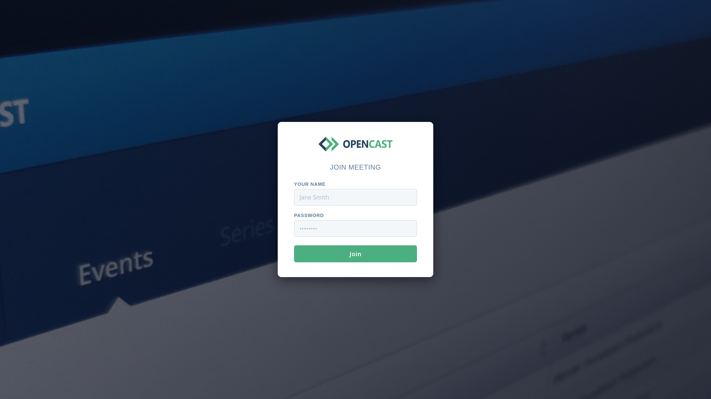

# Opencast Meet

A lightweight BigBlueButton web portal with Opencast integration.



## Overview

Opencast Meet serves a simple login form where visitors enter their name and a
password. On submission the server ensures the configured meeting room exists,
then redirects the browser directly into BigBlueButton as a viewer or
moderator depending on which password was used. It is designed to run behind a
reverse proxy.

## Configuration

All configuration is via environment variables. If a `.env` file is present in
the working directory it is loaded automatically — copy `.env.example` to get
started.

### Required

| Variable | Description |
| --- | --- |
| `BBB_SERVER_URL` | BigBlueButton server base URL, e.g. `https://bbb.example.com/bigbluebutton/` |
| `BBB_SERVER_SECRET` | BBB shared API secret |
| `APP_USER_PASSWORD` | Password granting viewer access |
| `APP_MODERATOR_PASSWORD` | Password granting moderator access |

### Meeting

| Variable | Default | Description |
| --- | --- | --- |
| `BBB_MEETING_ID` | `opencast-meet` | Stable room identifier. Use a comma-separated list for multiple rooms (e.g. `room-a,room-b`). |
| `BBB_MEETING_NAME` | `Opencast Meeting` | Room display name. Use a comma-separated list matching `BBB_MEETING_ID` (e.g. `Room A,Room B`). Supports `{{DATE}}` placeholder. When multiple rooms are configured a dropdown appears in the login form. |
| `BBB_MUTE_ON_START` | | Mute participants on join |
| `BBB_RECORD` | | Enable recording |
| `BBB_AUTO_START_RECORDING` | | Start recording immediately |
| `BBB_ALLOW_START_STOP_RECORDING` | | Let participants control recording |
| `BBB_LOGIN_URL` | | Redirect URL on login |
| `BBB_LOGOUT_URL` | | Redirect URL after leaving the meeting |
| `BBB_WELCOME_MESSAGE` | | Message shown inside the meeting |
| `BBB_PRE_UPLOADED_PRESENTATION` | | URL of a pre-loaded presentation |
| `APP_LISTEN_ADDR` | `127.0.0.1:8080` | HTTP listen address |
| `METRICS_USERNAME` | | Username for `/metrics` Basic Auth (must be paired with `METRICS_PASSWORD`) |
| `METRICS_PASSWORD` | | Password for `/metrics` Basic Auth (must be paired with `METRICS_USERNAME`) |

### Opencast Integration

| Variable | Description |
| --- | --- |
| `OC_SERIES_ID` | UUID of the target Opencast series |
| `OC_DC_CREATOR` | Presenter name for Opencast metadata |
| `OC_ADD_WEBCAMS` | Include webcam streams in the recording (`true`/`false`) |
| `OC_ACL_READ_ROLES` | Comma-separated roles with read access |
| `OC_ACL_WRITE_ROLES` | Comma-separated roles with write access |

## Running

### Local

```sh
cp .env.example .env
# edit .env
go run .
```

Then open <http://localhost:8080>.

### Docker

```yaml
services:
  opencast-meet:
    image: ghcr.io/virtuos/opencast-meet:latest
    ports:
      - "8080:8080"
    env_file: .env
```
